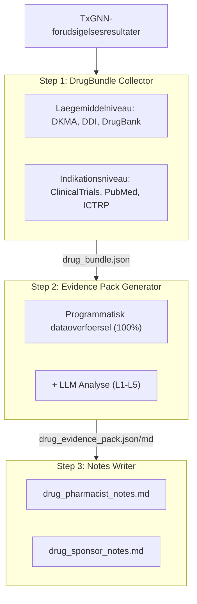
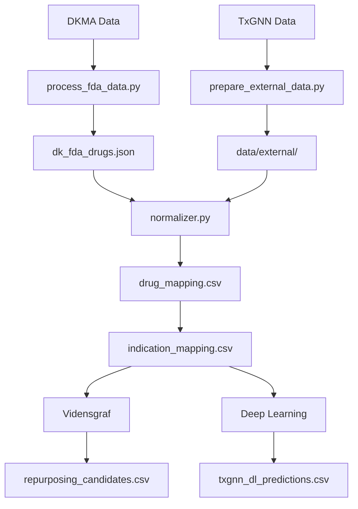

# DkTxGNN - Danmark: Laegemiddelrepositionering

[](https://dktxgnn.yao.care)
[](https://opensource.org/licenses/MIT)

Forudsigelser for laegemiddelrepositionering af DKMA-godkendte laegemidler (Denmark) ved hjaelp af TxGNN-modellen.

## Ansvarsfraskrivelse

- Resultaterne af dette projekt er kun til forskningsformaal og udgoer ikke medicinsk raadgivning.
- Kandidater til laegemiddelrepositionering kraever klinisk validering foer anvendelse.

## Projektoversigt

### Rapportstatistikker

| Element | Antal |
|------|------|
| **Laegemiddelrapporter** | 501 |
| **Samlede forudsigelser** | 8,553,242 |
| **Unikke laegemidler** | 501 |
| **Unikke indikationer** | 17,081 |
| **DDI-data** | 302,516 |
| **DFI-data** | 857 |
| **DHI-data** | 35 |
| **DDSI-data** | 8,359 |
| **FHIR-ressourcer** | 501 MK / 50,000 CUD |

### Fordeling af evidensniveauer

| Evidensniveau | Antal rapporter | Beskrivelse |
|---------|-------|------|
| **L1** | 0 | Flere Fase 3 RCT'er |
| **L2** | 0 | Enkelt RCT eller flere Fase 2 |
| **L3** | 0 | Observationelle studier |
| **L4** | 0 | Praekliniske / mekanistiske studier |
| **L5** | 501 | Kun computationel forudsigelse |

### Efter kilde

| Kilde | Forudsigelser |
|------|------|
| KG | 7,257,992 |
| KG + DL | 1,293,551 |
| DL | 1,699 |

### Efter tillid

| Tillid | Forudsigelser |
|------|------|
| very_high | 56,640 |
| high | 1,238,042 |
| medium | 7,258,270 |
| low | 290 |

---

## Forudsigelsesmetoder

| Metode | Hastighed | Noejagtighed | Krav |
|------|------|--------|----------|
| Vidensgraf | Hurtig (sekunder) | Lavere | Ingen saerlige krav |
| Deep Learning | Langsom (timer) | Hoejere | Conda + PyTorch + DGL |

### Vidensgraf-metode

```bash
uv run python scripts/run_kg_prediction.py
```

| Metrik | Vaerdi |
|------|------|
| DKMA Samlet antal laegemidler | 2,733 |
| Repositioneringskandidater | 8,551,543 |

### Deep Learning-metode

```bash
conda activate txgnn
PYTHONPATH=src python -m dktxgnn.predict.txgnn_model
```

| Metrik | Vaerdi |
|------|------|
| Samlede DL-forudsigelser | 1,295,249 |
| Unikke laegemidler | 501 |
| Unikke indikationer | 17,081 |

### Scorefortolkning

TxGNN-scoren repraesenterer modellens tillid til et laegemiddel-sygdomspar, med et interval fra 0 til 1.

| Taerskelvaerdi | Betydning |
|-----|------|
| >= 0.9 | Meget hoej tillid |
| >= 0.7 | Hoej tillid |
| >= 0.5 | Moderat tillid |

#### Scorefordeling

| Taerskelvaerdi | Betydning |
|-----|------|
| ≥ 0.9999 | Ekstremt hoej tillid, modellens mest sikre forudsigelser |
| ≥ 0.99 | Meget hoej tillid, vaerd at prioritere til validering |
| ≥ 0.9 | Hoej tillid |
| ≥ 0.5 | Moderat tillid (sigmoid-beslutningsgraense) |

#### Definitioner af evidensniveauer

| Niveau | Definition | Klinisk betydning |
|-----|------|---------|
| L1 | Fase 3 RCT eller systematisk gennemgang | Kan understoette klinisk brug |
| L2 | Fase 2 RCT | Kan overvejes til brug |
| L3 | Fase 1 eller observationsstudie | Kraever yderligere evaluering |
| L4 | Sagsrapport eller praeklinisk forskning | Endnu ikke anbefalet |
| L5 | Kun beregningsbaseret forudsigelse, ingen klinisk evidens | Kraever yderligere forskning |

#### Vigtige paamindelser

1. **Hoeje scorer garanterer ikke klinisk effektivitet: TxGNN-scorer er vidensgrafikbaserede forudsigelser, der kraever klinisk validering.**
2. **Lave scorer betyder ikke ineffektiv: modellen har muligvis ikke laert visse associationer.**
3. **Anbefales at bruge med valideringspipeline: brug dette projekts vaerktojer til at gennemgaa kliniske forsoeg, litteratur og anden evidens.**

### Valideringspipeline



---

## Hurtigstart

### Trin 1: Download data

| Fil | Download |
|------|------|
| DKMA Data | Datakilde |
| node.csv | [Harvard Dataverse](https://dataverse.harvard.edu/api/access/datafile/7144482) |
| kg.csv | [Harvard Dataverse](https://dataverse.harvard.edu/api/access/datafile/7144484) |
| edges.csv | [Harvard Dataverse](https://dataverse.harvard.edu/api/access/datafile/7144483) |
| model_ckpt.zip | [Google Drive](https://drive.google.com/uc?id=1fxTFkjo2jvmz9k6vesDbCeucQjGRojLj) |

### Trin 2: Installer afhaengigheder

```bash
uv sync
```

### Trin 3: Behandl laegemiddeldata

```bash
uv run python scripts/process_fda_data.py
```

### Trin 4: Forbered ordforraadsdata

```bash
uv run python scripts/prepare_external_data.py
```

### Trin 5: Koer vidensgraf-forudsigelse

```bash
uv run python scripts/run_kg_prediction.py
```

### Trin 6: Opsaet Deep Learning-miljoe

```bash
conda create -n txgnn python=3.11 -y
conda activate txgnn
pip install torch==2.2.2 torchvision==0.17.2
pip install dgl==1.1.3
pip install git+https://github.com/mims-harvard/TxGNN.git
pip install pandas tqdm pyyaml pydantic ogb
```

### Trin 7: Koer Deep Learning-forudsigelse

```bash
conda activate txgnn
PYTHONPATH=src python -m dktxgnn.predict.txgnn_model
```

---

## Ressourcer

### TxGNN Kerne

- [TxGNN Paper](https://www.nature.com/articles/s41591-024-03233-x) - Nature Medicine, 2024
- [TxGNN GitHub](https://github.com/mims-harvard/TxGNN)
- [TxGNN Explorer](http://txgnn.org)

### Datakilder

| Kategori | Data | Kilde | Note |
|------|------|------|------|
| **Laegemiddeldata** | DKMA | - | Denmark |
| **Vidensgraf** | TxGNN KG | [Harvard Dataverse](https://dataverse.harvard.edu/dataset.xhtml?persistentId=doi:10.7910/DVN/IXA7BM) | 17,080 diseases, 7,957 drugs |
| **Laegemiddeldatabase** | DrugBank | [DrugBank](https://go.drugbank.com/) | Kortlaegning af laegemiddelingredienser |
| **Laegemiddelinteraktioner** | DDInter 2.0 | [DDInter](https://ddinter2.scbdd.com/) | DDI-par |
| **Laegemiddelinteraktioner** | Guide to PHARMACOLOGY | [IUPHAR/BPS](https://www.guidetopharmacology.org/) | Godkendte laegemiddelinteraktioner |
| **Kliniske forsoeg** | ClinicalTrials.gov | [CT.gov API v2](https://clinicaltrials.gov/data-api/api) | Register for kliniske forsoeg |
| **Kliniske forsoeg** | WHO ICTRP | [ICTRP API](https://apps.who.int/trialsearch/api/v1/search) | International platform for kliniske forsoeg |
| **Litteratur** | PubMed | [NCBI E-utilities](https://eutils.ncbi.nlm.nih.gov/entrez/eutils/) | Medicinsk litteratursoeging |
| **Navnekortlaegning** | RxNorm | [RxNav API](https://rxnav.nlm.nih.gov/REST) | Standardisering af laegemiddelnavne |
| **Navnekortlaegning** | PubChem | [PUG-REST API](https://pubchem.ncbi.nlm.nih.gov/docs/pug-rest) | Kemiske stof-synonymer |
| **Navnekortlaegning** | ChEMBL | [ChEMBL API](https://www.ebi.ac.uk/chembl/api/data) | Bioaktivitetsdatabase |
| **Standarder** | FHIR R4 | [HL7 FHIR](http://hl7.org/fhir/) | MedicationKnowledge, ClinicalUseDefinition |
| **Standarder** | SMART on FHIR | [SMART Health IT](https://smarthealthit.org/) | EHR-integration, OAuth 2.0 + PKCE |

### Modeldownloads

| Fil | Download | Note |
|------|------|------|
| Fortraenet model | [Google Drive](https://drive.google.com/uc?id=1fxTFkjo2jvmz9k6vesDbCeucQjGRojLj) | model_ckpt.zip |
| node.csv | [Harvard Dataverse](https://dataverse.harvard.edu/api/access/datafile/7144482) | Knudedata |
| kg.csv | [Harvard Dataverse](https://dataverse.harvard.edu/api/access/datafile/7144484) | Vidensgrafdata |
| edges.csv | [Harvard Dataverse](https://dataverse.harvard.edu/api/access/datafile/7144483) | Kantdata (DL) |

## Projektintroduktion

### Mappestruktur

```
DkTxGNN/
├── README.md
├── CLAUDE.md
├── pyproject.toml
│
├── config/
│   └── fields.yaml
│
├── data/
│   ├── kg.csv
│   ├── node.csv
│   ├── edges.csv
│   ├── raw/
│   ├── external/
│   ├── processed/
│   │   ├── drug_mapping.csv
│   │   ├── repurposing_candidates.csv
│   │   ├── txgnn_dl_predictions.csv.gz
│   │   └── integration_stats.json
│   ├── bundles/
│   └── collected/
│
├── src/dktxgnn/
│   ├── data/
│   │   └── loader.py
│   ├── mapping/
│   │   ├── normalizer.py
│   │   ├── drugbank_mapper.py
│   │   └── disease_mapper.py
│   ├── predict/
│   │   ├── repurposing.py
│   │   └── txgnn_model.py
│   ├── collectors/
│   └── paths.py
│
├── scripts/
│   ├── process_fda_data.py
│   ├── prepare_external_data.py
│   ├── run_kg_prediction.py
│   └── integrate_predictions.py
│
├── docs/
│   ├── _drugs/
│   ├── fhir/
│   │   ├── MedicationKnowledge/
│   │   └── ClinicalUseDefinition/
│   └── smart/
│
├── model_ckpt/
└── tests/
```

**Forklaring**: 🔵 Projektudvikling | 🟢 Lokale data | 🟡 TxGNN-data | 🟠 Valideringspipeline

### Dataflow



---

## Citering

Hvis du bruger dette datasaet eller denne software, bedes du citere:

```bibtex
@software{dktxgnn2026,
  author       = {Yao.Care},
  title        = {DkTxGNN: Drug Repurposing Validation Reports for Denmark DKMA Drugs},
  year         = 2026,
  publisher    = {GitHub},
  url          = {https://github.com/yao-care/DkTxGNN}
}
```

Citer ogsaa den originale TxGNN-artikel:

```bibtex
@article{huang2023txgnn,
  title={A foundation model for clinician-centered drug repurposing},
  author={Huang, Kexin and Chandak, Payal and Wang, Qianwen and Haber, Shreyas and Zitnik, Marinka},
  journal={Nature Medicine},
  year={2023},
  doi={10.1038/s41591-023-02233-x}
}
```
